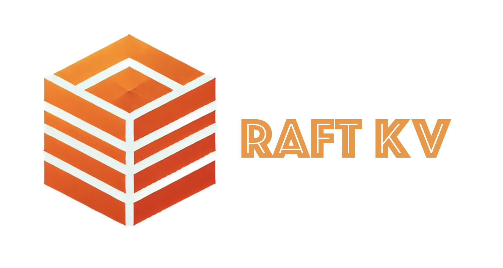

# raft-kv

## About this project
Distributed storage services are the backbone of modern Internet applications. However, building a robust distributed storage service from scratch is challenging, particularly in orchestrating the subtle cases in distributed consensus. 

The **Raft-KV** addresses this by providing an **abstract Raft consensus layer** that can be integrated with **any** key-value (KV) storage engine. This separation of concerns between the storage layer and the distributed consensus layer enhances modularity, making it easier and more efficient for developers to build reliable storage clusters. 

The project's goal is to enable developers to build **robust** distributed storage clusters by simply **"plugging"** their custom KV storage engine into the Raft consensus layer. This provides a flexible and reliable solution for distributed data management. 

this project serves as a comprehensive study of distributed systems, consensus algorithms, and modern C++ development.

## Getting started

### Build
    mkdir -p raft-kv/build
    cd raft-kv/build
    cmake .. -DCMAKE_BUILD_TYPE=Release
    make -j8
    
### Running a cluster

First install [goreman](https://github.com/mattn/goreman), which manages Procfile-based applications.

    goreman start
    
    
### Test

install [redis-cli](https://github.com/antirez/redis), a redis console client.

    redis-cli -p 63791
    127.0.0.1:63791> set mykey myvalue
    OK
    127.0.0.1:63791> get mykey
    "myvalue"
    
remove a node and replace the myvalue with "new-value" to check cluster availability:

    goreman run stop node2
    redis-cli -p 63791
    127.0.0.1:63791> set mykey new-value
    OK
    
bring the node back up and verify it recovers with the updated value "new-value":

    redis-cli -p 63792
    127.0.0.1:63792> KEYS *
    1) "mykey"
    127.0.0.1:63792> get mykey
    "new-value"
    
### benchmark

    redis-benchmark -t set,get -n 100000 -p 63791
    
    ====== SET ======
      100000 requests completed in 1.35 seconds
      50 parallel clients
      3 bytes payload
      keep alive: 1
    
    96.64% <= 1 milliseconds
    99.15% <= 2 milliseconds
    99.90% <= 3 milliseconds
    100.00% <= 3 milliseconds
    73909.83 requests per second
    
    ====== GET ======
      100000 requests completed in 0.95 seconds
      50 parallel clients
      3 bytes payload
      keep alive: 1
    
    99.95% <= 4 milliseconds
    100.00% <= 4 milliseconds
    105485.23 requests per second
    
    
    
    
    
    
    

